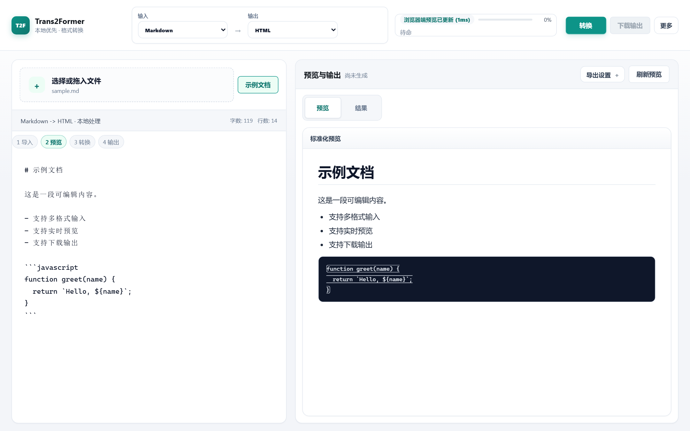

<div align="center">


# Trans2Former

**本地优先的多格式文档转换工具 —— 把跨格式转换变成可验证、可修复、可解释的工程**

[](LICENSE)
[](CHANGELOG.md)
[](https://github.com/Vantalens/Trans2Former/actions/workflows/ci.yml)
[](#快速开始)
[](docs/BENCHMARK.md)
[](CONTRIBUTING.md)

[简体中文](README.md) · [English](docs/i18n/README.en.md) · [日本語](docs/i18n/README.ja.md) · [한국어](docs/i18n/README.ko.md) · [Français](docs/i18n/README.fr.md) · [Español](docs/i18n/README.es.md) · [Deutsch](docs/i18n/README.de.md) · [Português](docs/i18n/README.pt-BR.md) · [Русский](docs/i18n/README.ru.md) · [العربية](docs/i18n/README.ar.md)


</div>

---

**Trans2Former** 是一款桌面级文档转换工具：**14 种输入格式、11 种输出格式**，全部转换在本机完成。不上传文件、不依赖 Office / LibreOffice / Pandoc，并对每次转换生成可解释的质量检验报告。

## ✨ 特性

- 🔒 **本地优先** —— 转换、OCR、公式渲染全部离线执行，文档处理阶段禁止联网
- ✅ **转换可检验** —— 规则 diff、SSIM 视觉对比、OCR 回读三层校验，统一写入质量报告并在工作台可视
- 👁️ **本地 OCR** —— 内置 PP-OCRv5（ONNX Runtime，WebGPU / WASM），支持方向校正、倾斜纠偏、自适应去噪、版面结构识别与质量评分
- ∑ **公式渲染** —— 本地 KaTeX 排版 `$...$` / `$$...$$`，零联网
- ⚡ **高性能** —— Web Worker 并行管线，不设人为文件大小上限
- 📦 **零运行时依赖** —— 核心转换不需要任何外部办公软件

## 🖥️ 界面一览

<div align="center">

<br/>
<sub>转换工作台：导入 → 预览 → 转换 → 输出，全程本地处理</sub>
</div>

## 📄 支持的格式

| 类别 | 输入（14 种） | 输出（11 种） |
| --- | --- | --- |
| 文档 | Markdown、HTML、TXT、DOCX、PDF、EPUB | Markdown、HTML、TXT、DOCX、PDF、EPUB |
| 数据 | JSON、CSV、XML、XLSX | JSON、CSV、XML、XLSX |
| 演示 | PPTX | PPTX |
| 图片 | PNG（OCR 识别） | （PNG → HTML、TXT、JSON、PDF 通过 OCR 识别后转换） |
| 实验性 | DOC（仅文本提取）、OFD（L0 级：容器解析，战略攻坚格式） | — |

常用路径：Markdown ↔ HTML · DOCX → Markdown · PDF → Markdown · XLSX ↔ CSV · HTML → PDF

完整转换矩阵见 [docs/product/CONVERSION_PATHS.md](docs/product/CONVERSION_PATHS.md)。

## 🚀 快速开始

开发和 CI 支持 Node.js 22 或 24；仓库默认版本见 `.nvmrc`（Node 24）。Node 25+ 当前不在支持范围。

```bash
npm install      # 安装依赖
npm start        # 启动，浏览器打开 http://localhost:3000
npm test         # 运行完整测试套件（含真实浏览器转换矩阵）
npm run coverage # 在受支持 Node 版本上运行覆盖率门禁
```

桌面应用（Tauri 2）与发布包：

```bash
npm run desktop:dev       # 桌面开发模式
npm run release:prepare   # 生成发布包
```

安装指南见 [docs/development/INSTALL.md](docs/development/INSTALL.md)。

## 🧠 核心本地能力

增强能力直接内置于核心模块，不使用插件机制；模型资源不入 git，由 vendor 脚本按钉定来源下载并经 SHA-256 校验（[scripts/paddleocr-models.manifest.json](scripts/paddleocr-models.manifest.json)），随发布包分发、开箱即用。

- **PP-OCRv5 本地 OCR**：图片与扫描 PDF 的检测 + 识别 + 方向分类，含纠偏、去噪、版面归并和置信度评分
- **Tesseract.js 轻量 OCR**：可选引擎，在安全中心导入 tessdata 即可启用
- **三层转换校验**：规则 diff + SSIM + OCR 回读，结果可解释、可降级
- **KaTeX 数学渲染**：零联网

OCR 运行时准备：

```bash
npm install onnxruntime-web
npm run vendor:onnx
npm run vendor:paddle
```

浏览器端验证记录见 [docs/research/PP_OCRV5_BROWSER_VERIFICATION.md](docs/research/PP_OCRV5_BROWSER_VERIFICATION.md)。

## 🏗️ 架构演进路径

- **✅ v1（当前）**：单一 DocumentModel 统一承载所有格式
  - 9 种块类型（heading / paragraph / list / table / code / quote / image / asset / raw）
  - 模型定义见 [docs/document-model.schema.json](docs/document-model.schema.json)
  - 已验证支持 14 种输入 → 11 种输出转换矩阵
- **🎯 v2（设计中）**：多域模型架构，语义解耦
  - 五个规范模型：SemanticDoc（流式文档）、WorkbookModel（表格）、SlideModel（演示）、FixedLayoutModel（固定版式）、AssetGraph（共享资产）
  - 详见 [docs/architecture/MULTI_DOMAIN_MODEL_DESIGN.md](docs/architecture/MULTI_DOMAIN_MODEL_DESIGN.md) 和 [docs/V2_MULTI_DOMAIN_MODELS.md](docs/V2_MULTI_DOMAIN_MODELS.md)
  - 跨模型转换显式 mapper，降级可见
- **⏱️ 迁移计划**：Phase 5 完成详细设计（✅ 已完成），Phase 6-11 分阶段实施（约 15 周），保证向下兼容

## 📁 项目结构

```text
Trans2Former/
├── public/          # 前端应用（纯 ESM，无构建步骤）
│   ├── core/        # 数据模型、格式注册表、OCR、校验
│   ├── formats/     # 各格式 reader / writer
│   └── workers/     # Web Worker 转换管线
├── docs/            # 完整文档
├── samples/         # 测试样例
├── scripts/         # 构建、vendor 与测试脚本
└── src-tauri/       # Tauri 桌面壳
```

## 🛡️ 数据安全

- 不上传文件、文件名、转换结果或错误日志
- 文档处理阶段禁止网络访问
- 不接入第三方转换 API 或分析 SDK

完整策略见 [docs/security/SECURITY_POLICY.md](docs/security/SECURITY_POLICY.md)。

## 📚 文档

| 入口 | 内容 |
| --- | --- |
| [docs/README.md](docs/README.md) | 文档总索引 |
| [docs/development/INSTALL.md](docs/development/INSTALL.md) | 安装指南 |
| [CHANGELOG.md](CHANGELOG.md) | 版本记录 |
| [CONTRIBUTING.md](CONTRIBUTING.md) | 贡献与测试要求 |
| [docs/BENCHMARK.md](docs/BENCHMARK.md) | 基准测试报告 |
| [docs/architecture/MULTI_DOMAIN_MODEL_DESIGN.md](docs/architecture/MULTI_DOMAIN_MODEL_DESIGN.md) | v2 多域模型设计文档 |
| [docs/V2_MULTI_DOMAIN_MODELS.md](docs/V2_MULTI_DOMAIN_MODELS.md) | v2 多域模型参考手册 |
| [docs/V2_MIGRATION_GUIDE.md](docs/V2_MIGRATION_GUIDE.md) | v2 迁移指南 |
| [docs/architecture/CONVERSION_ROUTING.md](docs/architecture/CONVERSION_ROUTING.md) | 转换路由 |
| [docs/security/SECURITY_POLICY.md](docs/security/SECURITY_POLICY.md) | 安全策略 |

## ⚠️ 已知限制

1. 部分复杂样式在跨格式转换中无法完全保留
2. PPTX 动画与图表尚不支持
3. OCR 对强斜体、艺术字识别有限；DOC / OFD 输入为实验性
4. 暂不支持 ZIP64 超大压缩包

## 🤝 贡献

欢迎提交 Issue 与 Pull Request：fork 仓库 → 创建特性分支 → 提交更改 → 发起 PR。开发规范与测试要求见 [CONTRIBUTING.md](CONTRIBUTING.md)。

## 📜 许可证

MIT，详见 [LICENSE](LICENSE)。第三方依赖的许可证信息见 [THIRD_PARTY_NOTICES.md](THIRD_PARTY_NOTICES.md)。

---

<div align="center">

**链接**：[GitHub 仓库](https://github.com/Vantalens/Trans2Former) · [Issues](https://github.com/Vantalens/Trans2Former/issues) · [Discussions](https://github.com/Vantalens/Trans2Former/discussions) · [Linux.do 社区](https://linux.do/)

如果这个项目对你有帮助，欢迎点一个 ⭐ Star！

</div>
