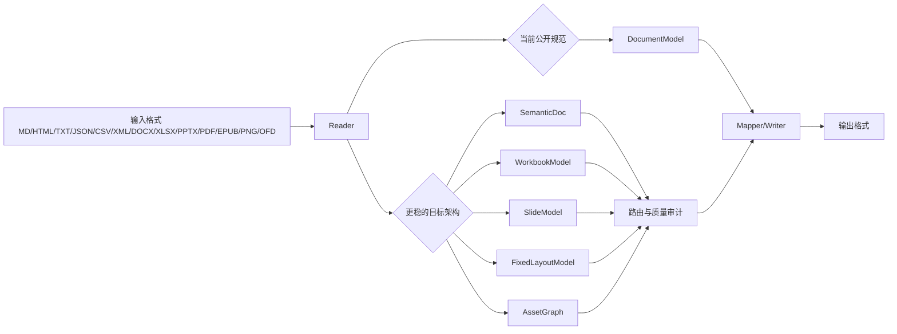

# Trans2Former 项目深度研究与评价验收报告

## 执行摘要

Trans2Former 的当前状态适合被界定为“**本地优先、多格式文档转换工作台的阶段性可验收原型**”。仓库首页将它描述为一个支持 12 种输入、11 种输出格式的桌面文档转换工具，核心卖点是本地处理、Web Worker 并行、本地 OCR、LaTeX 渲染，以及写入 QualityReport 的三层转换后检验。仓库同时给出了较完整的产品、架构、格式、质量、安全文档目录，这说明项目已经超出“单页 Demo”，具备系统化工程设计意识。

从验收角度看，我的结论是：**建议“有条件通过”阶段性验收**。通过的理由在于：项目方向明确，问题定义清晰，本地安全边界设计成熟，文档体系丰富，测试入口明确，且已经把 DOCX、PPTX、PDF、OCR、桌面壳、质量报告、发布准备等问题拆成可管理的子任务。条件则主要来自三类风险：**文档与实现状态存在冲突、可复现实验入口存在缺口、公开性能指标不足**。这些问题不会否定项目价值，但会直接影响对外宣称的严谨性与正式交付可信度。

如果把本项目定位为“**研究型工程平台**”，它已经具备展示价值；如果定位为“**高保真全格式转换产品**”，当前公开证据还不够。更准确的表述是：**Trans2Former 已完成可靠骨架，正在从单一 `DocumentModel` 体系过渡到多域模型与本地增强引擎体系**。这一判断与仓库 README 中出现的 `SemanticDoc / WorkbookModel / SlideModel / FixedLayoutModel / AssetGraph` 设计，以及旧文档中仍然以单一 `DocumentModel` 为统一中间层的定义形成了明显对照。

下表给出本次验收建议的摘要版本。

| 维度     | 结论    | 说明                                   |
| ------ | ----- | ------------------------------------ |
| 研究选题   | 通过    | 方向清晰，聚焦本地优先、多格式转换、质量可解释、插件/增强能力治理。   |
| 工程架构   | 通过    | 模块边界、桌面化路线、质量报告、安全模型都已形成文档化设计。       |
| 功能完成度  | 有条件通过 | 基础链路明确，重格式与高保真仍处于增强或攻坚阶段。            |
| 文档一致性  | 需整改   | 插件模式、OFD 路线、PNG 输出、模型结构、脚本入口存在冲突。    |
| 可复现性   | 需整改   | README 列出的部分命令在 `package.json` 中未声明。 |
| 正式对外发布 | 暂不建议  | 建议先补基准、统一文档、完善发布工件与许可证说明。            |

## 项目介绍与必要背景

Trans2Former 解决的问题可以概括为一句话：**在本地设备上，把多种异构文档格式转成另一种格式，同时尽量保留结构、内容、资源引用与可解释的损失说明**。这类项目的难点不在“文件能否被打开”，而在“语义能否被抽出、损失能否被说明、输出能否被验证、工程能否长期维护”。仓库首页把项目定位为专业级桌面文档转换工具，并强调“零上传”“本地 OCR”“多语言”“质量报告”，这说明作者把隐私、安全与可解释性当作产品主轴，而不是只做格式堆砌。

理解这个项目需要几个基础概念。第一是**中间表示**，也就是把不同格式先读成统一的内部结构，再写出到目标格式。仓库旧文档把这一层定义为 `DocumentModel`，并明确规定所有转换遵循 `input format -> DocumentModel -> output format`。第二是**可解释降级**，也就是当目标格式表达能力更弱时，不隐瞒损失，而是用 warnings、占位文本、资产引用和 metadata 说明损失发生在哪里。第三是**质量回读**，仓库把规则 diff、SSIM 视觉比对和 OCR 回读合并写入 `QualityReport`，这比只比文件是否生成出来更接近真正工程验收。

从更具体的技术基础看，项目涉及四类核心知识。其一是 **OOXML 容器**，因为 DOCX、XLSX、PPTX 本质上都是 ZIP 封装的 XML 族格式；其二是 **PDF 文本抽取与 OCR**，因为 PDF 既可能是文本型页面对象，也可能是扫描图像；其三是 **前端本地计算架构**，也就是浏览器 / Tauri + Web Worker + WASM / WebGPU 的本地执行模型；其四是 **格式能力矩阵与用户允许路径矩阵**，因为“仓库里有 reader/writer”与“产品界面应该允许用户选择该路径”并不是同一件事。仓库在 `CONVERSION_PATHS.md` 中专门把这两者分开定义，这一点很成熟。

对于非本领域读者，最值得把握的一点是：**“文档转换”与“文件另存为”不是一回事**。Markdown、HTML、JSON 更偏语义；DOCX、PPTX、XLSX 兼有结构与样式；PDF、PNG 更偏固定版式或像素终点。把这些格式放进同一平台，最稳妥的方法通常不是强行让所有对象都挤进一个模型，而是建立若干域模型，再在路由层决定是否做语义投影、是否保留页对象、是否启动 OCR 或高保真渲染。你上传的前期工程分析文档也给出了非常接近的判断：应从单一 `DocumentModel` 升级为多域模型，并把 OCR、OFD、高保真版面恢复做成可治理的增强层。

下表把本项目中最关键的术语做一个非专家友好的解释。

| 术语              | 在本项目中的含义                                                                                  | 为什么重要                           |
| --------------- | ----------------------------------------------------------------------------------------- | ------------------------------- |
| `DocumentModel` | 仓库旧文档定义的统一中间文档模型，包含 `blocks / assets / metadata / sourceSpan / warnings` 等字段。             | 决定转换是否可解释、是否可审计。                |
| 多域模型            | README 已出现 `SemanticDoc / WorkbookModel / SlideModel / FixedLayoutModel / AssetGraph` 术语。 | 解决文档、表格、幻灯片、固定版式对象语义差异过大的问题。    |
| QualityReport   | 由规则 diff、SSIM、OCR 回读组成的转换后检验报告。                                                           | 让“转换成功”从文件生成提升到质量可验证。           |
| 可解释降级           | 复杂样式、分页、动画、扫描件等无法完整保留时，用 warnings 和占位方式明确说明。                                              | 防止错误地把低保真输出包装成高保真。              |
| 本地优先            | 所有文档处理本地完成，处理阶段禁止联网。                                                                      | 直接关系到隐私合规与安全边界。                 |
| OCR             | 对图片或扫描页进行文字识别。README 指向本地 PP-OCRv5，也支持轻量 Tesseract.js 路线。                                 | 决定 PNG / 扫描 PDF / 部分 OFD 的可处理性。 |
| SSIM            | 结构相似度指标，用于视觉回归对比。README 将其纳入三层质量检验。                                                       | 比单纯文本 diff 更适合验收 PDF/PNG 等视觉终点。 |

## 仓库结构、依赖与复现实验

从仓库根目录可以直接看出项目是一个“**文档很多、前端核心明确、桌面壳已接入、测试脚本密集**”的工程。根目录包含 `docs / public / samples / scripts / src-tauri / src / tests`，以及 `README.md / INSTALL.md / CONTRIBUTING.md / CHANGELOG.md / package.json` 等入口文件；README 进一步把 `public/core/models`、`public/core/format-registry.js`、`public/formats`、`public/workers` 标成主要实现位置。这说明当前项目的主要实现重心仍在前端和浏览器执行核心，Tauri 更像桌面承载层。

| 目录或文件                                                                                     | 角色                                   | 验收价值               |
| ----------------------------------------------------------------------------------------- | ------------------------------------ | ------------------ |
| `README.md`                                                                               | 产品概览、快速开始、能力矩阵、路线图。                  | 适合答辩时展示项目定位与当前边界。  |
| `package.json`                                                                            | 运行入口、测试入口、发布入口、依赖定义。                 | 是复现实验的第一事实来源。      |
| `docs/README.md`                                                                          | 文档总导航，列出产品、架构、质量、安全、输入输出 MVP、路线图等专题。 | 说明项目有成体系的设计文件。     |
| `docs/CONVERSION_PATHS.md`                                                                | 定义用户可见转换路径矩阵与程序层强制校验规则。              | 是“转换路径”术语的主定义来源。   |
| `docs/CONVERSION_POLICY.md`                                                               | 定义可解释降级、warnings、资源追踪。               | 是正确性与质量评价的核心文档。    |
| `docs/DOCUMENT_MODEL_SCHEMA.md`                                                           | 定义 `DocumentModel` 顶层结构和审计字段。        | 是模型设计与后续架构争议的核心证据。 |
| `docs/DOCX_INPUT_MVP.md`、`PPTX_INPUT_MVP.md`、`PDF_TEXT_EXTRACTION_MVP.md`、`P4_OUTPUTS.md` | 给出各格式支持范围与已知限制。                      | 适合逐项验收输入输出能力。      |
| `src-tauri/`                                                                              | 桌面壳。                                 | 证明项目不是纯网页演示。       |
| `scripts/` 与 `tests/ snapshots/ conversions`                                              | 自动化测试与快照验证。                          | 是复现与回归基线。          |

依赖层面，`package.json` 当前非常轻：运行时依赖只有 `express`，可选依赖是 `pdfjs-dist`，桌面开发通过 `npm exec @tauri-apps/cli -- dev/build` 调用 Tauri CLI。这个依赖面与 README 中“零依赖”表述并不冲突，但要准确理解为“**不依赖外部 Office / LibreOffice / Pandoc 作为系统前置软件**”，不是“项目自身无 npm 依赖”。

同时，复现入口存在一个必须在答辩中主动说明的问题：README 提到 `npm run vendor:onnx`、`npm run vendor:paddle`、`npm run samples:generate`，但当前抓取到的 `package.json` 并没有这几个 scripts。也就是说，至少在本次审阅所见的公开快照里，**文档命令与包脚本清单并未完全对齐**。这会直接影响第三方验收人“按 README 逐条运行”的成功率。

推荐的复现实验顺序如下表。表中的“预期观察项”分成两类：一类是仓库已给出明确支持的，另一类是当前快照下应当暴露出来的不一致信号。

| 目标               | 命令                                                                                     | 预期观察项                                                                                                          | 判定标准                                            |
| ---------------- | -------------------------------------------------------------------------------------- | -------------------------------------------------------------------------------------------------------------- | ----------------------------------------------- |
| 获取代码             | ```bash\ngit clone https://github.com/Vantalens/Trans2Former.git\ncd Trans2Former\n``` | 能进入项目根目录；此步骤属于标准仓库获取，不在仓库文档中单独说明。                                                                              | 成功获取源码。                                         |
| 安装依赖             | ```bash\nnpm install\n```                                                              | README 将其列为标准安装入口。                                                                                             | 安装完成，无致命依赖冲突。                                   |
| 启动 Web 工作台       | ```bash\nnpm start\n```                                                                | 应启动 `src/web-server.js` 对应的本地服务，并可通过 `http://localhost:3000` 打开界面。`package.json` 与 README 对此一致。                | 浏览器可访问页面。                                       |
| 运行全量测试           | ```bash\nnpm test\n```                                                                 | 应串行执行 smoke、snapshot、capability audit、quality、browser smoke、queue、desktop shell、安全、资源预算、release readiness 等脚本。 | 退出码为 0。                                         |
| 桌面壳自检            | ```bash\nnpm run desktop:check\n```                                                    | `package.json` 明确提供该脚本。                                                                                        | 自检通过。                                           |
| 开发态桌面运行          | ```bash\nnpm run desktop:dev\n```                                                      | 会拉起 Tauri 开发壳。仓库文档把桌面路线定义为 Tauri + Web-GUI。                                                                    | 开发壳可启动。                                         |
| 构建桌面包            | ```bash\nnpm run desktop:build\n```                                                    | 生成桌面构建工件；README 显示 Windows 桌面发布已经完成，跨平台包仍在进行中。                                                                 | 至少一套构建链可完成。                                     |
| Release 准备       | ```bash\nnpm run release:prepare\n```                                                  | 调用 `sync-pdfjs-vendor.js` 与 `prepare-release.js`。                                                              | 产出发布准备工件。                                       |
| 验证 README 与脚本一致性 | ```bash\nnpm run vendor:onnx\nnpm run vendor:paddle\nnpm run samples:generate\n```     | README 提及这些入口；若当前 `package.json` 未同步，预期会出                                                                      | 当前快照下出现缺失脚本，说明文档待同步；若你本地成功，说明仓库已更新，需在报告中注明版本差异。 |

对于实验样例，README 说仓库有 `samples/` 样例文件，且复杂样例可程序化生成；根目录页面也展示了 `samples` 与 `tests/ snapshots/ conversions`。不过，仓库公开页面没有给出一个正式命名的数据集清单，也没有公开基准表。这里更像“**fixture / snapshot 回归体系**”，而不是已经发表的 benchmark suite。

## 模型架构与转换路径分析

这部分是整个项目最值得向导师重点展示的地方，因为它体现了项目的**设计雄心**与**当前架构过渡状态**。

先看当前公开定义。旧文档把 `DocumentModel` 明确写成统一中间模型，并规定所有格式转换都遵循 `input format -> DocumentModel -> output format`。`CONVERSION_POLICY.md` 也继续以 `DocumentModel` 为核心，强调正文语义优先、样式可降级、资源进入 `AssetStore`、输出要可读。

再看 README。它在“技术架构”部分列出了 `SemanticDoc / WorkbookModel / SlideModel / FixedLayoutModel / AssetGraph` 五类模型，但紧接着给出的“转换流程”示意仍然是 `输入文件 → Reader → DocumentModel → Mapper → Writer → 输出文件`。这说明 README 反映的是**目标架构或正在迁移中的架构**，而文档制度层面仍以单一 `DocumentModel` 为当前规范。

这就是我对项目架构的核心判断：**仓库已经意识到单模型方案不够，但公开规范尚未完全迁移到多模型方案**。这一点与你上传的前期分析文档的判断完全一致：文档、表格、幻灯片、固定版式和资源图谱不宜永久压缩成一个模型，否则越往后做，warnings 会越来越多，而 writer 的可恢复性会越来越弱。

下面这个图能更直观地说明“当前实现语义”和“更稳架构”的关系。



关于你特别指定的“**转换路径**”术语，仓库其实给出了相当明确的主定义。在 `CONVERSION_PATHS.md` 中，作者把它定义为“**用户转换路径矩阵**”，即对某个输入格式，产品实际允许导出到哪些输出格式；同时强调这和“系统内部具备哪些 reader/writer”并不是一回事，前端必须动态刷新输出选项，程序层也必须校验路径。这个定义非常产品化，也非常工程化。

因此，本项目中“转换路径”的**首选解释**应当是：

| 解释候选             | 与仓库的一致性                                                                       | 结论                      |
| ---------------- | ----------------------------------------------------------------------------- | ----------------------- |
| 数据预处理 → 模型 → 后处理 | 中等一致。README 里有 OCR 预处理、本地模型、QualityReport 后检验；转换流程也有 Reader/Mapper/Writer 顺序。 | 可以作为技术视角的“处理流水线”解释。     |
| 模型或框架之间的转换       | 低一致。仓库没有围绕 PyTorch/ONNX/TensorRT 等模型框架转换展开设计。                                 | 当前公开资料中基本未指定。           |
| 训练 → 微调 → 部署     | 低一致。仓库是文档转换产品工程，不是训练仓库；OCR 侧以模型导入和本地推理为主。                                     | 当前公开资料中基本未指定。           |
| 输入格式到输出格式的允许路径矩阵 | 高一致。`CONVERSION_PATHS.md` 直接定义了这层含义，并要求前后端共同强制执行。                             | 这是本仓库中最准确、最应该在答辩中采用的定义。 |

进一步看路径矩阵本身，项目不是“所有输入都可以导向所有输出”。例如，TXT 不直接导出表格与演示，XLSX 不提供 PPTX/DOCX 等不可靠跨类型输出，PDF 当前主要瞄准文本型抽取，不提供表格/演示的高保真输出，PPTX 可以抽取为文档或导出 PDF，但不做反向复杂编辑。这种设计说明作者并没有追求“矩阵越大越好”，而是在努力把**产品允许路径**与**技术可信路径**对齐。

这也是本项目最成熟的产品观念之一：**路径可用性优先于格式名数量**。对验收者而言，这比“支持 12×11”更重要，因为真正决定用户体验的是“哪条路径能稳定、能解释、能回归”。

## 多维评估与验收结论

### 正确性、代码质量与文档一致性

从正确性和代码组织角度，项目有很强的制度化意识。`DocumentModel` 定义了 `sourceSpan`、`id`、`warnings` 等审计字段；转换策略要求输出可读、资源可追踪；桌面架构文档明确了 FileQueue、QualityReportPanel、VersionHistory、PluginManager 等模块职责；项目评估文档也主动指出 `public/app.js` 承载过多逻辑，是下一阶段架构债。这种“先承认复杂性，再给治理文件”的做法很成熟。

当前最明显的问题不在“有没有文档”，而在“**文档之间的状态是否一致**”。我认为这是本项目需要优先整改的地方。至少存在四组公开冲突：其一，README 说“不再提供插件安装模式，增强能力直接并入核心本地模块”，`PLUGIN_SECURITY_MODEL.md` 却仍完整定义 install mode / processing mode / GitHub Releases 插件分发；其二，README 说 OFD 支持已内置核心持续攻坚，`P4_OUTPUTS.md` 却说 OFD 不进入默认核心包而要通过本地插件推进；其三，README 已列出多域模型术语，`DocumentModel Schema` 仍是单一中间层规范；其四，README 提到部分命令，但 `package.json` 没有对应 scripts。

这类冲突对研究原型本身的杀伤力有限，对正式验收的杀伤力很大。原因很简单：导师和答辩委员通常会把“文档是否自洽”当成工程成熟度的直接信号。当前仓库给人的观感是：**设计在快速前进，规范同步稍微落后**。这是一种发展中的典型状态，完全可修，但必须正面承认。

### 可复现性、性能、可扩展性与鲁棒性

可复现性方面，项目有两大优点。第一，运行入口非常清楚：`npm install`、`npm start`、`npm test`、`npm run release:prepare`、`npm run desktop:dev/build/check` 都在 README 或 `package.json` 中可直接找到。第二，测试命令不是一句抽象的“run tests”，而是显式串联了 smoke、snapshot、能力审计、质量验证、浏览器入口、队列、安全、资源预算、发布就绪等脚本。

可复现性的短板也很清楚。README 说“测试覆盖 28 个脚本全量通过”，但 `package.json` 的 `test` 命令直接展示的是 15 个顶层脚本串联；README 还列出若干未在 `package.json` 中声明的命令。换句话说，**复现实验的故事线已经写出来了，脚本清单与文档清单尚未完全对齐**。对于自己开发时这不算大问题，对于第三方复核和验收，这是需要修正的。

性能方面，README 给出的是**能力型声明**而非**定量型证明**：Web Worker 并行、本地 OCR、无人为文件大小上限、桌面体验的冷启动与异步目标都写得很明确，但在本次审阅可见的公开文档里，没有找到系统性的延迟、吞吐、内存峰值、OCR CER/WER、SSIM 或结构保真率表格。因此，对性能的严谨表述应当是：“**项目已经设计了性能与质量验证机制，但公开基准结果目前未指定**。”

可扩展性与鲁棒性是项目的强项。桌面架构文档反复强调异步任务、虚拟滚动、低内存管线、版本历史、失败恢复；项目评估文档把大文件、插件隔离、平台 smoke、复杂样例回归列成具体工作项；README 把质量报告、warnings、OCR 识别质量评分都纳入主界面能力。这说明项目并不满足于单次成功，而是在朝“**可以长期跑、可以批量跑、失败可以解释**”的方向建设。

### 安全、许可、社区与活动度

安全是本项目目前最稳定、也最容易在答辩里加分的维度。README 明确写了“所有转换本地完成、处理阶段禁止联网、不接第三方 API 或分析 SDK”；插件安全模型进一步把 install mode 与 processing mode 区分开，并要求处理阶段 `local-only-no-network`。无论最后保留插件模式还是并入核心模式，这条安全原则已经写得非常清楚。

许可方面，仓库采用 MIT 许可证，公开页面也显示为 MIT。这个选择对学术项目和工程复用都比较友好。需要补充的一点是：README 把 PP-OCRv5、本地模型 vendor、可选 Tesseract.js、可选 ONNX Runtime 放入能力叙述时，最好在发布工件和文档中进一步把第三方代码、模型、字典与校验清单做成单独 notice。PaddleOCR 3.0 技术报告明确表述 PaddleOCR 是 Apache 许可开源工具包，这类信息非常适合被纳入发布说明。

社区与活动度方面，当前仓库的外部信号还比较弱。仓库页面显示 5 stars、0 forks、0 watching、0 issues、0 PRs、99 commits、4 个 releases，最新发布版本是 `v2.2.0`，日期为 2026-05-26。与此同时，根目录里又已经出现 `RELEASE_NOTES_v2.3.0.md` 文件。这说明项目内部开发是活跃的，但外部协作与发布同步机制还比较早期。验收时应把它表述为“**小团队高投入建设中的早期公开仓库**”，这个表述最贴切。

下面给出本次多维评价的量化版本。

| 维度     |   分数 | 评价                                        | 主要证据                                                                                |
| ------ | ---: | ----------------------------------------- | ----------------------------------------------------------------------------------- |
| 正确性    | 7/10 | 路径矩阵、降级策略、格式 MVP 文档完整，能力边界写得诚实。           | `CONVERSION_PATHS`、`CONVERSION_POLICY`、各格式 MVP 文档。                                  |
| 代码质量   | 7/10 | 模块边界与职责有设计，已识别 `public/app.js` 过载问题。      | `DESKTOP_APP_ARCHITECTURE` 与 `PROJECT_ASSESSMENT_2026-05-03`。                       |
| 文档质量   | 8/10 | 文档量大、覆盖面广、适合研究展示。                         | `docs/README.md` 列出完整专题文档体系。                                                        |
| 文档一致性  | 5/10 | 模型、插件、OFD、PNG、脚本入口存在冲突。                   | README、`PLUGIN_SECURITY_MODEL`、`P4_OUTPUTS`、`DOCUMENT_MODEL_SCHEMA`、`package.json`。 |
| 可复现性   | 6/10 | 基本入口清晰；部分命令未在 manifest 中声明。               | README 与 `package.json` 对照。                                                         |
| 性能证据   | 5/10 | 有性能设计，有质量回读；公开基准表未指定。                     | README、桌面架构文档。                                                                      |
| 可扩展性   | 8/10 | Tauri + Web-GUI + Worker + 本地模型/增强路线非常清晰。 | README、桌面架构、项目评估。                                                                   |
| 鲁棒性    | 7/10 | warnings、QualityReport、失败恢复思想成熟。          | `CONVERSION_POLICY`、README、桌面架构。                                                    |
| 安全     | 8/10 | 本地优先、处理禁网、权限与降级路径意识强。                     | README 与 `PLUGIN_SECURITY_MODEL`。                                                   |
| 许可证    | 8/10 | MIT 明确；第三方模型 notice 仍需完善。                 | README、仓库页、PaddleOCR 3.0 报告。                                                        |
| 社区与活动度 | 4/10 | 公开协作指标较弱，适合描述为早期公开仓库。                     | GitHub 仓库页指标。                                                                       |

综合这张表，我给出的正式验收意见是：**阶段性成果通过，产品级高保真宣称建议收敛，正式开源发布建议在文档统一和基准补齐后推进**。这个结论既保留了项目的亮点，也能让导师看到你对工程真实状态有非常清醒的把握。

## 替代方案对比、验证基准与改进路线

如果把 Trans2Former 放进更大的开源生态里比较，它的竞争位置很清楚：**它不是单一格式转换器，也不是纯 OCR 工具，更不是云端 API 封装；它想做的是本地优先、工作台化、可解释、可审计的多格式转换平台。** 你上传的工程分析文档也把最成熟的开源路径描述为“轻量文本/结构化文本”和“表格”两大类，把 DOCX/EPUB 视为中等，把 PDF/OFD/PNG 反向可编辑视为高风险链路，这与仓库当下的能力边界高度一致。

| 方案                                  | 擅长点                                                                                                       | 相对 Trans2Former 的优势       | 相对 Trans2Former 的短板                       | 结论                                            |
| ----------------------------------- | --------------------------------------------------------------------------------------------------------- | ------------------------- | ----------------------------------------- | --------------------------------------------- |
| Pandoc                              | 文本与结构化文档的 AST/语义转换。                                                                                       | 文本链成熟、生态大、命令行稳定。          | 本项目明确不希望依赖外部 Pandoc；本地工作台、安全可视与质量报告不是其主轴。 | 适合作为外部桥接参考，不适合作为本项目唯一内核。                      |
| LibreOffice / unoserver             | Office 生态与 Office→PDF 类高保真输出。                                                                             | 对复杂 Office 文档的成熟度更高。      | 需要外部软件、进程治理和平台一致性控制；与“纯本地前端内核”路线不同。       | 适合作为可选增强桥，不适合替代本项目定位。                         |
| Mammoth.js                          | DOCX→HTML 的语义抽取。                                                                                          | 在 DOCX 语义提取上轻量直接。         | 范围窄，不覆盖全矩阵，也不负责质量报告与多端工作台。                | 适合作为某些 reader 的设计参照。                          |
| PaddleOCR / PP-OCRv5 / PaddleOCR-VL | OCR 和文档解析。PP-OCRv5 主打轻量高效；PaddleOCR 3.0 把 PP-OCRv5、PP-StructureV3、ChatOCR 作为三大模块；PaddleOCR-VL 进一步扩展到文档解析。 | 在 OCR 与复杂文档解析上有专门模型优势。    | 本身不是全格式文档转换工作台。                           | 适合作为 Trans2Former 的 OCR / layout 外接能力，而不是替代品。 |
| Trans2Former                        | 本地优先、多格式、工作台化、质量可视、桌面壳化。                                                                                  | 在隐私、本地执行、产品化路径治理方面有鲜明差异化。 | 高保真链路和公开基准仍在建设。                           | 研究展示价值高，产品成熟度仍需补齐。                            |

针对“如何验证项目宣称”的问题，我建议把你答辩时的验收动作分成**仓库现有验证**和**建议新增基准**两层。前者证明你理解现状，后者证明你具备工程判断力。

| 验证层      | 建议做法                                                                                                                                                           | 建议指标                                     |
| -------- | -------------------------------------------------------------------------------------------------------------------------------------------------------------- | ---------------------------------------- |
| 现有脚本验收   | 逐个运行 `smoke-test / conversion-snapshot-test / conversion-quality-test / local-security-test / resource-budget-test / release-readiness-test`。citeturn4view0 | 所有脚本退出码为 0。                              |
| 语义等价验收   | 对 Markdown、HTML、TXT、DOCX→Markdown/HTML/JSON 做 round-trip 验证。                                                                                                   | 规范化文本等价率 ≥ 99% 作为建议阈值。                   |
| 结构保真验收   | 重点统计 heading、list、table、footnote、reference 命中率。                                                                                                                | 结构保真率 ≥ 90% 作为建议阈值。                      |
| 表格验收     | 对 CSV/XLSX/HTML table 做 header、cell、merge、formula cache 比较。                                                                                                    | 表格保真率 ≥ 98% 作为建议阈值。                      |
| 视觉验收     | 对 PDF / PNG 终点做 SSIM 或感知哈希对比。                                                                                                                                  | 视觉相似度 ≥ 95% 作为建议阈值。                      |
| OCR 验收   | 对 PNG / 扫描 PDF 在中英混排、旋转、噪声、倾斜场景下测 CER/WER。                                                                                                                     | 仓库未公开阈值；建议按语种分别设基线。                      |
| 资源与稳定性验收 | 测峰值 RAM、取消延迟、连续批量队列成功率。                                                                                                                                        | README 与桌面架构强调大文件和异步目标，但未公开具体数值，建议你本地补表。 |

结合仓库现状，我建议的改进路线如下。这条路线的优先级是按“最能快速提升验收可信度”的顺序排的，而不是按“最炫”的顺序排的。


| 优先级 | 建议                                                | 为什么优先                                        |
| --- | ------------------------------------------------- | -------------------------------------------- |
| 高   | **统一 README、`package.json`、安全文档、P4 文档、路径矩阵与发布说明** | 这是当前最影响第三方信任的问题。                             |
| 高   | **把“当前实现状态”和“目标架构状态”分列展示**                        | 现在多域模型与单模型定义并存，最容易让答辩委员误解。                   |
| 高   | **建立公开 benchmark 表**                              | 仓库已经有质量机制，当前最缺的是量化结果。                        |
| 中   | **把样例库做成正式 fixture corpus，并公开按格式分层的难例集**          | 能把“高保真”从口头表述变成可回归资产。                         |
| 中   | **将 `public/app.js` 拆分为更细粒度模块**                   | 项目评估文档已把它识别为风险点。                             |
| 中   | **把 OCR / 表格恢复 / PDF 反向恢复能力进一步模块化**               | 与多域模型更匹配，也便于资源预算和许可证治理。                      |
| 低   | **补强社区面与发布节奏**                                    | 当前 stars/forks/issues/PR 指标仍早期，适合在技术基线稳定后推进。 |

最终给导师的建议表述，我建议用下面这句最稳：

**Trans2Former 已经完成本地优先多格式转换平台的核心骨架，具备明确的中间表示、路径治理、安全边界、桌面化承载与质量回归设计；当前最需要补齐的是文档一致性、公开基准与高风险格式链路的量化验证，因此本项目适合作为阶段性成果有条件验收，通过后应进入“统一规范 + 基准固化 + 多域模型迁移”的下一阶段。** 