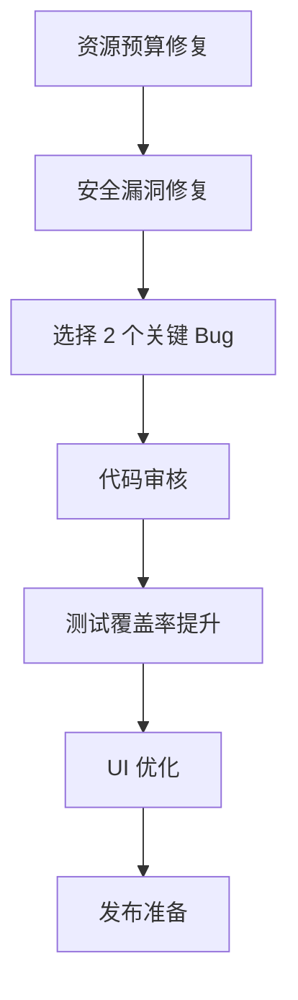

# Trans2Former 下一步行动指南

> 历史快照（2026-06-23）：不再作为当前计划；当前状态以 [progress.md](progress.md) 为准。

**快速决策版** - 基于当前代码状态的即时行动清单

---

## 🚨 立即处理（P0 - 阻断发布）

### 1. 资源预算超标
```bash
问题: scripts/ 目录 676KB，超出 512KB 预算 32%
原因: Phase 3 新增 10 个单元测试文件

立即行动:
1. 创建 test/ 目录结构
2. 移动单元测试文件 (binary-*.test.js 等)
3. 更新 package.json 的 test 命令
4. 验证测试通过

预期: 1-2 小时完成
```

**执行命令**:
```bash
mkdir -p test/unit/core test/unit/formats
git mv scripts/*-test.js test/unit/core/  # 移动新增测试
npm test  # 验证
```

---

## 🔥 高优先级（本周完成）

### 2. 安全漏洞修复
**Issue #129**: tessdata 导入只记录哈希不校验

```javascript
// 需要修改: public/core/model-cache.js
// 添加 SHA-256 完整性校验
async function verifyModelIntegrity(data, expectedHash) {
  const hash = await crypto.subtle.digest('SHA-256', data);
  const actual = Array.from(new Uint8Array(hash))
    .map(b => b.toString(16).padStart(2, '0')).join('');
  if (actual !== expectedHash) {
    throw new Error('Model integrity check failed');
  }
}
```

预期: 0.5 天

---

### 3. 关键 Bug 修复（选 2 个）

**Option A: Issue #88 - ZIP data descriptor**
- 文件: `public/core/zip-container.js`
- 影响: 真实 OOXML 文件无法打开
- 工作量: 0.5 天

**Option B: Issue #49 - OCR bbox 坐标系**
- 文件: `public/core/ocr-paddle.js`
- 影响: OCR 结果位置不准确
- 工作量: 0.5 天

---

## 📊 中优先级（下周完成）

### 4. 测试覆盖率提升
**目标**: 分支覆盖率 71.95% → 75%+

**策略**: 针对性添加边界测试
```bash
# 1. 生成覆盖率报告
npm run coverage
open coverage/index.html

# 2. 找出分支覆盖率 <60% 的文件
# 3. 为关键模块添加测试
```

预期: 2-3 天

---

### 5. UI 体验优化
**快速胜利清单**:
- [ ] 建立 CSS 变量系统（Design Token）
- [ ] 统一按钮样式（4 种实现 → 1 种）
- [ ] 添加 loading 状态
- [ ] 错误面板添加"重试"按钮

预期: 2-3 天

---

## 🎯 两周冲刺计划

### Week 1: 质量巩固
- Day 1-2: 资源预算修复 + 安全漏洞
- Day 3-4: 关键 Bug 修复 (2 个)
- Day 5: 代码审核 + Issue 清理

**交付物**:
- ✅ 所有测试通过
- ✅ 资源预算达标
- ✅ P2 安全 Issue 清零

---

### Week 2: 体验提升
- Day 1-3: 测试覆盖率优化
- Day 4-5: UI 体验改进
- Day 6-7: 发布准备

**交付物**:
- ✅ 分支覆盖率 ≥75%
- ✅ UI 一致性改善
- ✅ v2.4.0 发布就绪

---

## 📋 推荐执行顺序



### 第一天行动清单
1. ☐ 创建 test/ 目录，移动测试文件（2 小时）
2. ☐ 更新资源预算配置（30 分钟）
3. ☐ 修复 #129 安全漏洞（4 小时）
4. ☐ 运行完整测试验证（30 分钟）

### 第一周末检查点
- ☐ 资源预算测试通过
- ☐ 安全 Issue 关闭
- ☐ 至少 2 个 P2 Bug 修复
- ☐ 代码审核报告完成

---

## 🚀 快速决策树

**问题**: 时间紧张，应该先做什么？
```
→ 如果要发布: 优先 Phase 4 (资源预算) + Phase 5 (Issue 清理)
→ 如果要完善: 优先 Phase 6 (覆盖率) + Phase 7 (UI)
→ 如果要平衡: 按推荐顺序执行两周冲刺计划
```

**问题**: 某个 Phase 卡住了怎么办？
```
→ 跳过当前任务，记录为 Issue
→ 继续下一个独立任务
→ 最后统一清理遗留问题
```

---

## 📞 需要人工决策的问题

### 1. 资源预算策略
**选项 A**: 严格控制，必须在预算内（延后发布）
**选项 B**: 合理调整预算，反映实际需求（推荐）

### 2. Issue 修复优先级
**选项 A**: 只修复安全和阻断性问题（快速发布）
**选项 B**: 修复所有 P2 Issue（质量优先，推荐）

### 3. UI 优化范围
**选项 A**: 只修复明显不一致（快速）
**选项 B**: 建立完整 Design Token 体系（长远，推荐）

---

## 📚 详细计划文档

- **完整计划**: [EXECUTION_PLAN_POST_PHASE3.md](./EXECUTION_PLAN_POST_PHASE3.md)
- **原始计划**: [IMPLEMENTATION_PLAN.md](./IMPLEMENTATION_PLAN.md)
- **测试指南**: [TESTING_GUIDE.md](./TESTING_GUIDE.md)

---

**创建日期**: 2026-06-23  
**适用阶段**: Phase 3 完成后  
**预计周期**: 2 周（9-14 天）
